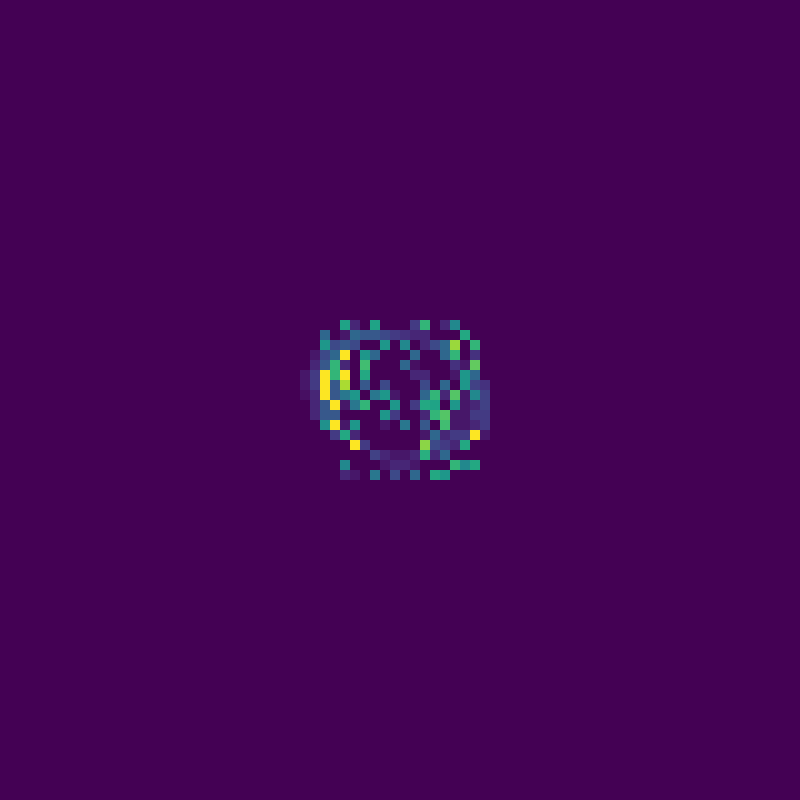

<!--  -->


# Evolving Artificial Life with Lenia SDT
By Lewis Howell

- [Evolving Artificial Life with Lenia SDT](#evolving-artificial-life-with-lenia-sdt)
  - [COMP5400M Bio-Inspired Computing - Assessment 2](#comp5400m-bio-inspired-computing---assessment-2)
  - [Introduction](#introduction)
    - [What is a cellular automaton?](#what-is-a-cellular-automaton)
    - [What is Lenia?](#what-is-lenia)
    - [What is the purpose of this tool?](#what-is-the-purpose-of-this-tool)
    - [What are the limitations?](#what-are-the-limitations)
- [Installation](#installation)
  - [Install FFmpeg:](#install-ffmpeg)
  - [Install required python packages](#install-required-python-packages)
- [Running the code](#running-the-code)
  - [Demos](#demos)
    - [Conway's Game of Life](#conways-game-of-life)
    - [SmoothLife](#smoothlife)
    - [Lenia](#lenia)
  - [Lenia Lifeforms](#lenia-lifeforms)
    - [Orbium](#orbium)
    - [New species(?) - Hopper](#new-species---hopper)
    - [New species(?) - Inversus](#new-species---inversus)
  - [Evolving new creatures](#evolving-new-creatures)
    - [Evolve kronium solidus](#evolve-kronium-solidus)
    - [Evolve orbium and save result as .json](#evolve-orbium-and-save-result-as-json)
    - [Changing conditons - loading from .json](#changing-conditons---loading-from-json)

## Introduction 

Lenia is a 2D cellular automaton which generalises upon the exemplar system 'Conway's Game of Life', originally devised by the British mathematician John Horton Conway. This system uses a relatively simple set of rules to govern cell birth and death on a discrete board, allowing diverse patterns to emerge and self-organise<sup>[1](https://www.jstor.org/stable/24927642)</sup>. Lenia, which is derived from the word for 'smooth' in Latin, expands upon these concepts, evolving artificial life in a continuous domain<sup>[2](https://arxiv.org/abs/1812.05433)</sup>. Simulations of Lenia reveal many diverse and complex artificial lifeforms which form spontaneously from random initial conditions. This evolution of creatures from the 'primordial soup' has potential implications within the domains of biology and artificial intelligence. 

See the public GitHub repo form the authors of Lenia here: https://github.com/Chakazul/Lenia 
Online notebook that inspired me to create the CLI tool: https://colab.research.google.com/github/OpenLenia/Lenia-Tutorial/blob/main/Tutorial_From_Conway_to_Lenia_(w_o_results).ipynb

### What is a cellular automaton?

Clasically, cellular automata operate a set of rules on a discrete grid of cells, updating the values of these cells at each timestep. For example, in Conway's Game of life, at each timestep any cell with two or three neighbours survives, any dead cell with three neighbours becomes a live cell (birth) and any cell with less than two or greater than three neighbours dies (death due to underpopulation or overpopulation)<sup>[1](https://www.jstor.org/stable/24927642)</sup>. 

Such systems are generally deterministic, and the result of the simulation depends entirely on the initial state of the board.  Despite this, cellular automata can be used to model a variety of complex systems composed of simple units. By generalising these models to a continuous domain, it is possible to model a variety of diffusion-based phenomena. Cellular automata have been used to model the biological process of morphogenesis which governs pattern formation in nature such as the spots on a cheetah or stripes of a zebra<sup>[3](https://arxiv.org/abs/2002.06112)</sup>. In chemistry, cellular automata can be used to model systems such as the Belousov-Zhabotinsky reaction, a chemical clock which results in beautiful concentric patterns which form spontaneously when the reaction is performed in a petri dish<sup>[4](https://pubs.acs.org/doi/10.1021/acs.jpcb.0c11079)</sup> (see a video of the reaction I performed during my undergraduate degree [here](https://www.youtube.com/watch?v=gbGxQ4yDSfc). At the highest level, some have even described the universe as a cellular automaton, whereby the speed of light governs the rate of updates in a deterministic universe<sup>[5](https://arxiv.org/abs/physics/9907013)</sup>. 

### What is Lenia?

Lenia is a generalised model of earlier 'Life' cellular automata such as Conway's Game of Life and SmoothLife<sup>[6](https://arxiv.org/abs/1111.1567)</sup>. Space, time, and cell states are made continuous such the cells can take any value between zero and one. The neighbourhood is expanded so that cells outside of the immediate proximity are considered (known as an extended Moore neighbourhood). Therefore, a kernel is therefore used which calculates the sum of the neighbours (weighted by the values of the kernel) by convolution with the grid. A generalised growth function is then used to update the cell values instead of count-based rules. 

The kernel for Conway's Game of Life therefore would be a 3x3 matrix with 0 in the centre and 1's surrounding (before normalisation). The growth function is discrete, with value 1 for 3 neighbours and value -1 for < 2 or > 3 neighbours. 


Lenia uses a Gaussian smoothed ring-like kernel which removes the orthogonal bias. The growth function is also a smooth Gaussian which leads to 'fluid-like' simulations.


More than 400 species have been identified by the authors of Lenia. The morphological characteristics of these species, behavioural dynamics, and ecological niches in the parameter space have been studied. A taxonomic naming system has even been created to classify these creatures into an 'artificial tree of life'. Although questions remain open about the relationship between Lenia's creatures and biological life, it is easy to see how such a system is interesting in the context of biology.

### What is the purpose of this tool?

This tool was developed formerly as an exercise to better understand the mathematics and computation behind Lenia. Such continuum cellular automata can be challenging to implement and have a variety of applications across the sciences. 

Secondly, although previous implementations of Lenia exist in python, these generally focus on demonstrating the pre-existing species and analysing them, not on the discovery of new species. Since the parameter space of Lenia is large, it is likely that many species still remain undiscovered. For this tool, I aimed to build a system that allows the evolution of novel creatures, hence the Lenia Species Discovery Tool - Lenia SDT.

This toolkit was built from scratch and allows for the evolution of a variety of existing species in addition to the discovery of new species. So far, two potentially new species have been discovered by the author. The first exhibits unusual bimodal locomotion, switching between 'hopping' and 'jumping' modalities named 'hopper'. The second is an oscillatory creature with four-fold radial symmetry (tetramerism) named 'inversus'. These creatures have yet to be formally verified as new species.

### What are the limitations?

This tool allows the evolution of Lenia species under a variety of conditions. Simulations can be saved as .gif or .mp4 and the parameters can be saved/loaded between experiments as a .json files. The installation and usage are described below.

In the future, the following improvements could be made:
 - Since the focus of this project was to obtain a working prototype, a command-line tool was proposed as the simplest to develop. In future, a GUI tool (such as tkinter) would allow further customisation and the gradual changing of parameters.
 - The computation time of simulations could be reduced by migrating from convolution to using Fast-Fourier transforms ([Convolution theorem](https://en.wikipedia.org/wiki/Convolution_theorem))
 - Integration of GPU acceleration would also significantly improve system performance.
 - AI object detection methods could be used to automatically identify and save new species. This would allow automation of the process.

# Installation
Lenia SDT was developed using Python3, with a simple command line interface. It requires a few basic packages and uses FFmpeg to save simulations as .mp4 videos. 

The software was developed in Debian 10 (Linux) but has also been tested working with Windows 10.

## Install FFmpeg:
FFmpeg is a open-source software designed for handling video. It is used to save the results of animations. 

Download it here [https://www.ffmpeg.org/download.html](https://link-url-here.org)

or via Linux command line (Ubuntu/Debian) 
```
sudo apt update

sudo apt install ffmpeg
```
To check the package has been correctly installed use: 
```
ffmpeg -version
```
## Install required python packages
This software uses a minimal number of external python packages (numpy, scipy and matplotlib only). To ensure the correct verions are installed, a ```requirements.txt``` file alongside a ```Pipfile.lock``` are provided. 

If using pip3, the requirements can be installed using:
```
pip3 install -r requirements.txt
```
or if using pipenv, the requirements can be installed using:
```
pipenv install
```
Activate the environment using 
```
pipenv shell
```

# Running the code
Lenia SDT is a command-line interface (CLI) tool which can take a variety of arguments to run different simulations

```
-------------------------------------------------------------------------------------------
  _                _          _____ _____ _______ 
 | |              (_)        / ____|  __ \__   __|
 | |     ___ _ __  _  __ _  | (___ | |  | | | |   
 | |    / _ \ '_ \| |/ _` |  \___ \| |  | | | |   
 | |___|  __/ | | | | (_| |  ____) | |__| | | |   
 |______\___|_| |_|_|\__,_| |_____/|_____/  |_|  
 
 Welcome to the Lenia Species Discovery Tool.
 Developed by Lewis Howell for COMP5400M Bio-Inspired Computing - Assessment 2 :)
 See https://arxiv.org/abs/1812.05433 for the original 2018 paper from the creators of Lenia
 
 For help use python Lenia.py -h
 -------------------------------------------------------------------------------------------
 Demos: 
 python3 Lenia.py --list-demos
 python3 Lenia.py --demo [DEMO]

 Evolve new species: 
    python3 Lenia.py -b 16 -k 16 -t 0.1 -m 0.135 -s 0.015 -x 10 -n 200

 or change conditions to see how species change:
    python3 Lenia.py -i ./datafiles/double_orbium.json -o destroyed_orbium.gif -m 0.11
-------------------------------------------------------------------------------------------
          
```

To see the available options use
```
python3 Lenia.py -h
```
```
Lenia cellular automata - developed by Lewis Howell for COMP5400M Bio-Inspired Computing - Assessment 2

optional arguments:
  -h, --help            show this help message and exit
  --conway              Demo Conway's game of Life with random ICs (default: False)
  --smooth-life         Demo SmoothLife with random ICs (default: False)
  --lenia               Demo Lenia with random ICs (default: False)
  --demo [DEMO]         simulate a pre-saved demo. To list the options use --list-demos (default: None)
  --list-demos          Show the demo options and exit (default: False)
  -v, --verbose         Verbose (default: False)
  -c CONFIG, --config CONFIG
                        path to config file (default: None)
  -i INFILE, --infile INFILE
                        path to source file (.json) if using pre-saved data (default: None)
  -o OUTFILE, --outfile OUTFILE
                        path to destination file (.gif or .mp4) (default: None)
  -j JSON, --json JSON  path to store results .json (default: None)
  -b BOARD_SIZE, --board-size BOARD_SIZE
                        board size (default: None)
  -k KERNEL_SIZE, --kernel-size KERNEL_SIZE
                        kernel size (default: None)
  -p KERNEL_PEAKS [KERNEL_PEAKS ...], --kernel-peaks KERNEL_PEAKS [KERNEL_PEAKS ...]
                        kernel peaks (default: None)
  -m MU, --mu MU        gaussian mean for kernel (mu) (default: None)
  -s SIGMA, --sigma SIGMA
                        gaussian stdev for kernel (sigma) (default: None)
  -t DT, --dt DT        timestep (0-1) (default: None)
  -n FRAMES, --frames FRAMES
                        number of frames to simulate (default: None)
  -x SEED, --seed SEED  the seed for random number generation (default: None)
```

## Demos
Several demos are provided alongisde the main utility to demonstrate the variety of possible outputs and simulations.

### Conway's Game of Life
To run the demo for the classic cellular automata Conway's Game of Life within the generalised Lenia framework run:
```
python3 Lenia.py --conway
```
<!--  -->


### SmoothLife
SmoothLife generalises Conway's Game of Life to the continuous domain (continous states, space and time). To simulate SmoothLife with random intital conditions use:
```
python3 Lenia.py --smooth-life
```


### Lenia
Lenia uses a smooth growth function and kernel to further generalise SmoothLife. This allows a variety of interesting artificial lifeforms to emerge.

To run a demo with random intitial conditions use:
```
python3 Lenia.py --lenia
```


## Lenia Lifeforms
Demos can also be run to show some of the lifeforms which have been dicovered and saved using this tool. 

Some of the famous Game of Life Lifeforms such as the gosper-glider-gun are also included to show the generalised Lenia framework can be used to simulate these creatures also.
```
# Get list of demos
python3 Lenia.py --list-demos 

# Run demo
python3 Lenia.py --demo [DEMO]
```

### Orbium

The famous Lenia trilobite-like glider 'orbium_unicaudatus'.
```
python3 Lenia.py --demo orbium
```


### New species(?) - Hopper

The novel 'hopper' creature (a new species(?) currently not formally described in the Lenia taxonomy).
This species exhibits a form of locomotion that may be new in the Lenia ecosystem. The creature moves with two distint modalities - a short 'hop' and a longer 'leap' whith a resting phase between.

```
python3 Lenia.py --demo hopper -n 1200
```


### New species(?) - Inversus

The novel 'inversus' creature (another new species(?)) with tetramerism (four-fold radial symmetry) which is common in many jellyfish in nature<sup>[7](https://www.bionity.com/en/encyclopedia/Symmetry_%28biology%29.html)</sup>.
```
python3 Lenia.py --demo inversus -n 500
```


## Evolving new creatures
New species can be evolved from the primordial soup (sparse-random matrix) by specifiying the kernel, board size and timestep.

### Evolve kronium solidus
```
python Lenia.py --mu 0.24 --sigma 0.029 --kernel-size 32 --kernel-peaks 1 0.3 --dt 0.0666 --seed 0 --board-size 32 --frames 500 -o kronium_sim.gif
```


### Evolve orbium and save result as .json
```
python3 Lenia.py -b 16 -k 16 -t 0.1 -m 0.135 -s 0.015 -x 10 -n 200 -o double_orbium.gif -j double_orbium.json
```


### Changing conditons - loading from .json
Changing the niche (parameter set such as sigma, mu and dt) can cause creatures to morph into new species (or to become unstable!).

```
python3 Lenia.py -i ./datafiles/double_orbium.json -o destroyed_orbium.gif -m 0.11
```


